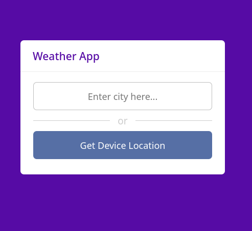
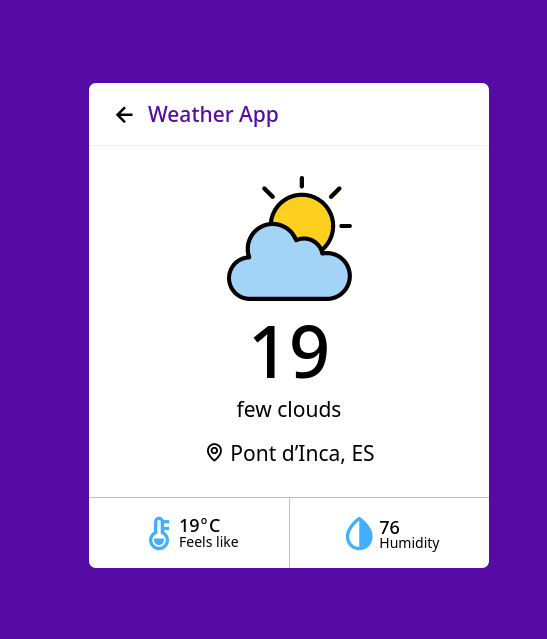

# JS Weather App

JS Weather App lets you to know current weather data on a location provided. If you allow the geo location permission, it took your data to find the place you are.

This is a little project, which is a part of my study path.

## Tech Stack

**Client:** HTML5, CSS3, JavaScript

## Screenshots

     

## Live Demo

[JS Weather App on Github Pages](https://enrique-mp.github.io/weather-app-js/)

## API Reference

The weather data is collect through the [OpenWeather API.](https://openweathermap.org/)

## Acknowledgements

- [Open Weather](https://openweathermap.org)
- [Dayo Jaiye](https://dev.to/devjaiye/build-a-weather-app-using-javascript-step-by-step-tutorial-24hi)

## Authors

- [@enrique-mp](https://github.com/enrique-mp)

## Badges

